# Java POO - Conceitos

# JAVA TESTE POO! :sweat_smile::sunglasses:

Aqui temos a Abstração de uma conta, par ao desafio Dio sobre Poo.
Foi um trabalho fazer uma lista de Contas para poder listar, mas consegui fazer. 
Ai, apreciem, e se puderem sugiram o que pode ser melhorado. 

# CLASSES :smiling_imp:

```mermaid
graph LR
A[iConta] -- Interface --> B((Conta))
B --> C((ContaCorrente))
B --> D((ContaPoupança))
C --> E[Main]
D --> E[Main]
F[Banco] -- Chamado --> E[Main]
```

